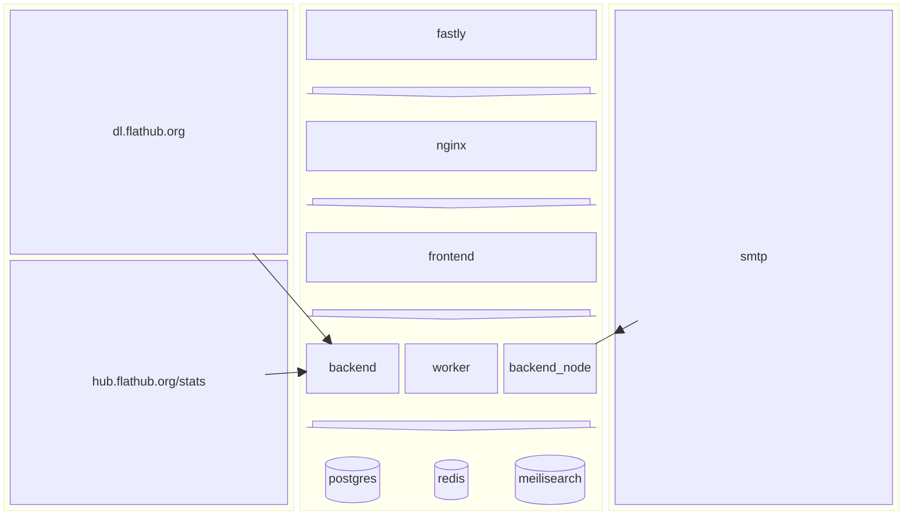

[](https://github.com/flathub-infra/website/actions/workflows/backend_ci.yml)
[](https://github.com/flathub-infra/website/actions/workflows/frontend_ci.yml)
[](https://hosted.weblate.org/engage/flathub/)

# flathub.org

This is the source code for the website, both backend and frontend. That's running on https://flathub.org.

## Code contribution

First of all thanks for considering contributing to this project!

Pull requests are welcome. Please, create an issue first explaining what you want to do and how.

If you want to contribute translations, please check out the instructions below.

### Overview

This overview is supposed to give you a quick grasp, of what we have and how it works. There are subtle differences between local/prod - this is an approximation.



### Development

You'll need `git`, `pnpm`, `docker` and `docker-compose-plugin`.

Go to the folder where you manage your projects and checkout this project.

Then start the backend:

```sh
cd backend
docker compose up
```

You might need to use `--build` to rebuild the images, when dependencies change.

Use another terminal session to run the following or use your browser to go to https://localhost:8000/docs and use the UI to run the `/update` endpoint.
This will populate the database with the latest data from Flathub.

```sh
curl -X POST localhost:8000/update
```

Then open a terminal and go to the frontend folder.
If it's the first time you run it, run

```sh
pnpm install
```

Then you should be able to start the dev server and see changes to the code:

```sh
pnpm dev
```

### Generating api client

We're generating the api client from the openapi spec. To do so, make sure the backend is running and then run:

```sh
pnpm openapi-codegen
```

### Storybook

You can also start the storybook via:

```sh
pnpm storybook
```

Or [view the current state of our storybook](https://main--6676acc57f6288e909a4e184.chromatic.com/)

## More backend instructions

You can find more backend instructions in the README in the backend folder.

## Translations

We're using [Weblate](https://hosted.weblate.org/engage/flathub/) to translate the UI. So feel free, to contribute translations over there.

<a href="https://hosted.weblate.org/engage/flathub/">

</a>

## Stripe payment testing

In both staging and development environments, Stripe is running in test mode (all data is fake).
To test payment, card details can be used from https://stripe.com/docs/testing.

## Thanks

<a href="https://www.chromatic.com/"></a>

Thanks to [Chromatic](https://www.chromatic.com/) for providing the visual testing platform that helps us review UI changes and catch visual regressions.
